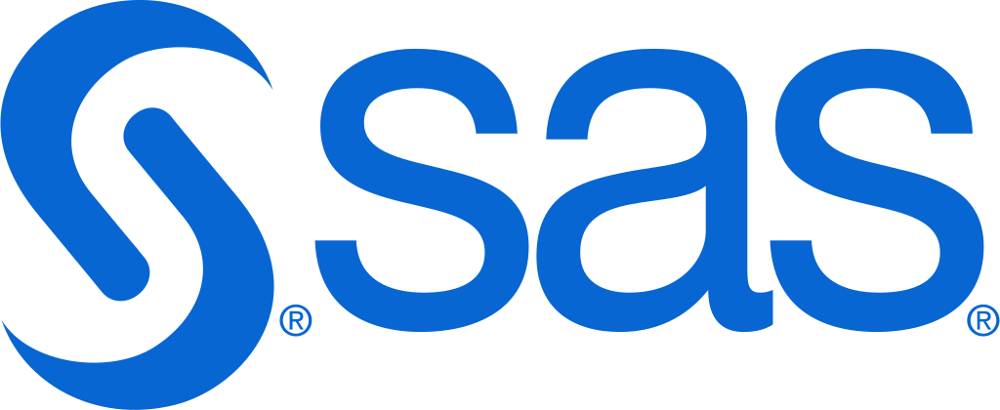

# Önder Akkaya

**Trainee Actuary | BSc. Statistics @ Hacettepe | Volunteer & Member @ Turkish Statistical Association** 

📍Çankaya, Ankara, Türkiye

[LinkedIn](https://www.linkedin.com/in/onderakkaya/) · [Email](mailto:onderakkayamd@gmail.com)

 

### About
I am a statistician and data scientist in training, with a broad focus on data science, data visualization, business intelligence and high-performance computing. Currently working on and looking to collaborate in such projects.

🏃 **Offline:** I'm a runner (PB 2:17 Half-Marathon), have a keen interest in photography ([@onder.chroma](https://instagram.com/onder.chroma)) and arts.

  <picture>
    <source media="(prefers-color-scheme: dark)" srcset="https://github-readme-stats-six-gold-26.vercel.app/api/top-langs/?username=onder-akkaya&theme=dark&hide_border=true&count_private=true">
    
  </picture>

 

&emsp;&emsp;&emsp;&emsp;&emsp;&emsp;&emsp;&emsp;<a href="https://www.sas.com/" target="_blank"><picture><source media="(prefers-color-scheme: dark)" srcset="./icons/sas_white.svg"></picture></a>

 

---

### Technical Specifications 🛠️

**Statistics & Data Science📊**
- Python
  - Core: NumPy, SciPy
  - Apple: [MLX](https://github.com/ml-explore/mlx), [CoreMLTools](https://github.com/apple/coremltools)
  - Data: Pandas, Polars
  - Geospatial: GeoPandas, Rasterio, Rasterstats, Fiona
  - Visualization: Matplotlib, Seaborn, Plotly
  - ML/Stats: Scikit-learn, StatsModels, XGBoost, LightGBM, CatBoost, Optuna
  - Deep Learning: TensorFlow, Keras, PyTorch
- R
  - Core: Tidyverse, data.table
  - Geospatial: sf, terra
  - Visualization: ggplot2, Shiny
  - ML/Stats: caret, tidymodels, xgboost, lme4, nlme
- SAS (Viya, Studio)
- Julia
  - Core: DataFrames.jl, CSV.jl
  - Statistics: StatsBase.jl, Distributions.jl, HypothesisTests.jl, GLM.jl, DataFramesMeta.jl
  - Geospatial: ArchGDAL.jl, GeoData.jl
  - Visualization: Plots.jl, Makie.jl
  - ML/Stats: MLJ.jl, Flux.jl
- Databases: SQL, PostgreSQL, PostGIS

**High-Performance Computing💻** · C/C++ · CUDA · [MPS (Metal Performance Shaders)](https://developer.apple.com/documentation/metalperformanceshaders) · OpenMP · MPI · Slurm

**Data Visualization & Business Intelligence📈** · Tableau · Power BI

**Scientific Writing📝** · Quarto · LaTeX · Markdown · RMarkdown

**Workflow & Tools🔧** · Git/GitHub · Jupyter · Google Colab · VS Code

**Design🖌️** · Adobe Creative Cloud · Canva

 

 

  

    
⚖️ <b>Legal Disclaimer & Trademark Notice / Yasal Uyarı</b> (Click to expand)

     
    
      <b>English (International & US Law Context):</b> 
      1. <b>Non-Affiliation:</b> Önder Akkaya is not affiliated, associated, authorized, endorsed by, or in any way officially connected with SAS Institute Inc., Posit PBC, JuliaHub Inc., Python Software Foundation, The R Foundation, or any of their subsidiaries or affiliates. 
      2. <b>Nominative Fair Use:</b> The names, logos, and badges used in this repository are for <b>identification, educational, and portfolio purposes only</b>. Their use falls under the doctrine of "Nominative Fair Use" (15 U.S.C. § 1115(b)(4)) to accurately describe the specific technical skills and tools proficiently utilized by the author. 
      3. <b>Trademark Ownership:</b> 
      • <b>SAS®:</b> SAS and all other SAS Institute Inc. product or service names are registered trademarks or trademarks of SAS Institute Inc. in the USA and other countries. ® indicates USA registration. 
      • <b>Quarto®:</b> Quarto and the Quarto logo are trademarks of Posit, PBC. 
      • <b>Julia:</b> Julia is a registered trademark of JuliaHub, Inc. 
      • <b>Python:</b> Python is a registered trademark of the Python Software Foundation. 
      • <b>R:</b> R is a registered trademark of The R Foundation for Statistical Computing. 
      4. <b>Good Faith:</b> All assets are used in good faith with no intent to infringe on intellectual property rights or cause consumer confusion regarding the source of goods/services. 
      <i>If you represent a trademark owner and have concerns, please contact via email for immediate resolution.</i>
       
      <b>Türkçe (Türk Hukuku Bağlamı):</b> 
      1. <b>Dürüst Kullanım (Honest Use):</b> Bu profilde yer alan markalar ve logolar, 6769 sayılı Sınai Mülkiyet Kanunu (SMK) Madde 7/5 uyarınca, kişinin sahip olduğu yetkinlikleri açıklamak ve hizmetin niteliğini belirtmek amacıyla, ticari hayatın dürüstlük ilkelerine uygun olarak (referans amaçlı) kullanılmıştır. 
      2. <b>İlişkisizlik Beyanı:</b> Önder Akkaya'nın, logoları kullanılan kurumlarla (SAS Institute, Posit, JuliaHub vb.) herhangi bir resmi ticari ortaklığı veya temsilciliği bulunmamaktadır. 
      <i>İlgili marka sahibini temsil ediyorsanız ve herhangi bir hak ihlali iddianız veya çekinceniz varsa, ivedilikle çözüm sağlanması adına lütfen e-posta yoluyla iletişime geçiniz.</i>
       
    
  

